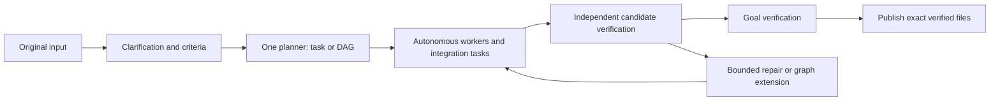

# Fleet — My AI Employee

Fleet turns a human goal into work performed by autonomous AI workers. It clarifies
requirements, plans a task or dependency graph, runs ready tasks concurrently, and
independently verifies the actual results. Workers inspect, edit, run tests and
repair their own work; Fleet does not reconstruct their edits from proposals.



The current execution backend combines **Codex's native sandbox** with Fleet's
existing disposable Docker process namespace. The namespace bounds CPU, memory,
processes and lifetime, including detached children. Workspaces are copied in;
operator checkouts, history and the Docker socket are never mounted into workers.
A failed isolation preflight blocks execution.

## Setup

Python 3.11–3.13, `uv`, and Docker are required. Prepare the runtime image explicitly:

```sh
uv sync --extra dev
.venv/bin/python -m build
docker build -f docker/autonomous-worker.Dockerfile -t fleet-worker docker
docker image inspect --format '{{.Id}}' fleet-worker
```

Use the returned immutable image ID, an explicit model name, and a separately
delegated Codex authentication file. Fleet does not discover or copy your normal
host credentials into a worker.

```sh
fleet init --model MODEL --image sha256:IMAGE_DIGEST \
  --auth-file /absolute/path/to/delegated-auth.json
fleet work 'Implement the requested feature and verify it' \
  --config fleet-run.json --root /path/to/repository
```

`fleet init` creates a new configuration file and never overwrites one. Review its
stage models, checks, authority and limits before starting work. The configuration
is snapshotted at Run creation. Repository inputs include tracked files, including
local tracked edits; untracked operator files are excluded. For a plain directory,
all regular input files are included except reserved runtime metadata.

The command prints a Run ID before execution. A successful Run holds a verified
Candidate; publish it to a **new** directory:

```sh
fleet inspect RUN_ID
fleet promote RUN_ID --destination /path/to/new-result
fleet history
fleet serve
```

The Inspector prints a private loopback URL. It shows criteria, graph dependencies,
Candidate lineage, verification, budgets, authority changes and execution activity.
It provides read-only inspection; operator actions use the CLI.

## Waiting and recovery

```sh
fleet answer RUN_ID 'The requested clarification'
fleet authority RUN_ID ATTEMPT_ID --decision approve
fleet resume RUN_ID
fleet cancel RUN_ID
fleet revoke RUN_ID
fleet revise RUN_ID 'An explicit replacement goal'
```

Clarification and authority waits are durable and leave no live human-facing
request open. Approval and application are separate events. Resume uses confirmed
policy and reconciles owned environments first. Revocation stops the Run; if a
controller is still shutting down, repeat the revocation command after it exits to
confirm cleanup. An explicit goal replacement creates a linked new Run and
invalidates publication of its predecessor. Automatic repair cannot change the
Goal or use this command to reset its budget.

Usage limits, budget exhaustion and cancellation stop further scheduling. **Fleet
never redeems reset tickets, buys allowance or changes providers to evade a limit.**
Unknown external outcomes retain an explicit uncertain state instead of triggering
a blind retry.

## Boundaries

The default strict policy permits local work. Configured balanced/permissive Runs
can grant coarse HTTPS destination access; that is not per-operation approval.
Service credential provisioning, read-only remote operation enforcement and strict
operation-level duplicate prevention require a real provider boundary and currently
block when requested. External acceptance requires operator-owned evidence checks,
not just a worker's claim. Claude execution is blocked because its required sandbox
application cannot currently be attested by this adapter.

There is one runtime and one set of Goal/Task/Candidate contracts. Version 0.3 does
not migrate old history or resume old proposal-based Runs. Historical code remains
in Git.

See [architecture](docs/architecture.md), [security](docs/security.md),
[configuration and recovery](docs/autonomous-runtime.md),
[isolation setup](docs/isolated-worker.md), and
[public Run interface](docs/run-interface.md). For development, follow
[CONTRIBUTING.md](CONTRIBUTING.md) and [the verification sequence](docs/development.md).

### Inspect command execution

New `fleet init` configurations retain bounded, redacted command snapshots for
post-run analysis. Use `fleet commands RUN_ID --stage worker --failed` to inspect
failures, or `fleet purge-commands RUN_ID` to remove that Run's command bodies.
`fleet init --no-command-capture` disables capture. Existing configurations do not
opt in automatically. See [command diagnostics](docs/run-interface.md#command-diagnostics)
for limits, retention, export, and the distinction between reported execution time
and buffered event-reception time.

### Bounded direct execution

Fresh `fleet init` configurations include `direct_execution: {"seconds": 60, "tokens": 100000}`.
After clarification and its configured review, local work can try one Worker directly,
without a planning model call. This is an execution attempt, not a task-complexity classifier.
Set `direct_execution` to `null` to use normal planning; existing configs without the field
retain their old behavior and canonical digests.

The direct Task preserves the entire clarified Goal. Bounded clarification observations
are available as non-authoritative investigation context, with the original input snapshot
and configuration/authority provenance. Workers must recheck changed or unsupported facts.

A completed direct candidate still receives independent verification, mandatory checks and
configured reviews. When the candidate, lineage, criteria and policy match exactly, the
same verification evidence supports two separately checked Task and Goal acceptance events.
Publication remains evidence-gated. Multi-task plans never use this evidence shortcut.

Direct execution is conservatively disabled when planning review is configured, alternative
worker selection is configured, any additional authority is available, or external-effect
criteria/checks are present. These runs use the existing planning path.

The local Worker allowance is cumulative across its model retries and charged to the Run.
Time is bounded through the existing invocation timeout; tokens are checked when the provider
reports usage, so they are a measured threshold, not a token-exact generation cap. Providers
may report usage only at turn completion, and a single turn can exceed that threshold.
Missing final token usage routes to normal planning. Global limits, cancellation and Usage
Limit stops take precedence and never grant fallback a fresh budget.

Local timeout, local allowance exhaustion, or unsuccessful direct work routes to normal
planning with bounded failure context and available unverified workspace artifacts. This
is not task completion or evidence of intrinsic complexity. Completed/exported partial
artifacts are retained; an interrupted native sandbox is destroyed for safety, so changes
not yet exported by the adapter cannot be recovered. An interrupted unfinished direct
attempt is not repeated on resume. Uncertain effects never trigger automatic fallback.
